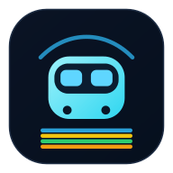

# BARTonic

<p align="center">
  
</p>

<p align="center">
  <a href="https://github.com/arun0009/bartonic/actions/workflows/ci.yml">
    
  </a>
  
  <a href="https://buymeacoffee.com/arun0009">
    
  </a>
  <a href="LICENSE">
    
  </a>
</p>

<p align="center">
  Live BART departures, saved commute routes, train-position hints, and a mobile-first map in a fast installable PWA.
</p>

<p align="center">
  <a href="https://bartonic.arun0009.workers.dev"><strong>Live App: bartonic.arun0009.workers.dev</strong></a>
</p>

---

## Install in 30 Seconds

| Platform | Steps |
| --- | --- |
| **iPhone (Safari)** | Open the [Live App](https://bartonic.arun0009.workers.dev) → Tap **Share** → **Add to Home Screen** → **Add** |
| **Android (Chrome)** | Open the [Live App](https://bartonic.arun0009.workers.dev) → Tap menu → **Install app** / **Add to Home Screen** → Confirm |
| **Desktop (Chrome/Edge)** | Open the [Live App](https://bartonic.arun0009.workers.dev) → Click the install icon in the address bar → Confirm |

<details>
  <summary><strong>If install does not update immediately</strong></summary>

1. Remove any old app icon from the home screen.
2. Open the site in the browser and refresh once.
3. Install again from the browser menu or share sheet.

</details>

## Why BARTonic

BARTonic is designed for the everyday Bay Area rider: open the app, check your next train in seconds, and make better commute decisions in real time.

## Features

- **My Routes** - Save commute pairs and get live countdowns every 15 seconds.
- **Add Route** - Create one-way or return routes with quick station search.
- **Quick Lookup** - Check any origin to destination with transfer-aware departures.
- **Train Position** - See where your train is right now using GTFS-Realtime hints.
- **System Map** - Pinch/zoom and drag the BART map with a clean mobile UI.
- **Installable PWA** - Add to home screen on iOS/Android/desktop.

<details>
  <summary><strong>Developer Section</strong></summary>

## Quick Start (Development)

```bash
npm install
npm run dev
```

Open [http://localhost:5173](http://localhost:5173).

## Scripts

- `npm run dev` - start local dev server
- `npm run build` - production build to `dist/`
- `npm run test` - deterministic fixture-based validation tests (CI-safe)
- `npm run test:live` - live BART audit for one origin (defaults to `DUBL`)
- `npm run test:live:all` - one-time live sweep across all origins
- `npm run lint` - lint TypeScript/React code
- `npm run icons` - regenerate favicon + PWA icon pack

### Live Audit Params

- `ORIGIN=<ABBR> npm run test:live` - pick a single origin, e.g. `ORIGIN=12TH`
- `LIMIT=<N> npm run test:live` - limit destination checks for faster runs
- `LIMIT_ORIGINS=<N> LIMIT_DEST=<N> npm run test:live:all` - sample run across origins/destinations
- Use `test:live` / `test:live:all` as manual pre-release checks (not required CI)

## Stack

- React 19 + TypeScript + Vite
- PWA via `vite-plugin-pwa`
- Data from [BART API](https://api.bart.gov/) and [BART GTFS-Realtime](https://www.bart.gov/schedules/developers/gtfs-realtime)

</details>

Not affiliated with BART.

## License

MIT
