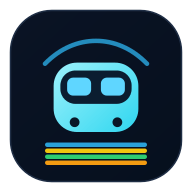
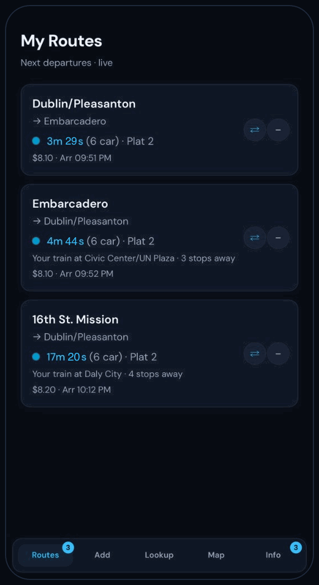

# BARTonic

<p align="center">
  
</p>

<p align="center">
  <strong>Your next BART train — in seconds.</strong><br />
  Live countdown, platform, and where the train actually is.
</p>

<p align="center">
  <a href="https://bartonic.arun0009.workers.dev"><strong>Open the live app →</strong></a>
</p>

<p align="center">
  
</p>

<p align="center">
  <a href="https://github.com/arun0009/bartonic/actions/workflows/ci.yml">
    
  </a>
  
  <a href="https://buymeacoffee.com/arun0009">
    
  </a>
  <a href="LICENSE">
    
  </a>
</p>

Save your commute. Open the app. See if you should run.

- **Second-precision countdown** — not “3 min”, **3m 29s**
- **Your train, not a headsign** — “Civic Center · 3 stops away”
- **Platform, cars, fare, arrival** — glance and go
- **Reverse trip** — check the other direction without retyping stations
- **Installable PWA** — home screen on iPhone, Android, and desktop

No account. No App Store. Free.

## Install in 30 seconds

| Platform | Steps |
| --- | --- |
| **iPhone (Safari)** | Open the [live app](https://bartonic.arun0009.workers.dev) → **Share** → **Add to Home Screen** |
| **Android (Chrome)** | Open the [live app](https://bartonic.arun0009.workers.dev) → menu → **Install app** |
| **Desktop (Chrome/Edge)** | Open the [live app](https://bartonic.arun0009.workers.dev) → install icon in the address bar |

<details>
  <summary><strong>If the home-screen icon does not update</strong></summary>

1. Remove the old icon.
2. Open the site in the browser and refresh once.
3. Install again from the share sheet or browser menu.

</details>

<details>
  <summary><strong>Developers</strong></summary>

## Quick Start

```bash
npm install
npm run dev
```

Open [http://localhost:5173](http://localhost:5173).

## Scripts

- `npm run dev` — local dev server
- `npm run build` — production build to `dist/`
- `npm run test` — fixture-based validation (CI-safe)
- `npm run test:live` — live BART audit for one origin (defaults to `DUBL`)
- `npm run test:live:all` — one-time live sweep across all origins
- `npm run lint` — TypeScript/React lint
- `npm run icons` — regenerate favicon + PWA icon pack

### Live audit params

- `ORIGIN=<ABBR> npm run test:live` — e.g. `ORIGIN=12TH`
- `LIMIT=<N> npm run test:live` — fewer destination checks
- `LIMIT_ORIGINS=<N> LIMIT_DEST=<N> npm run test:live:all` — sampled sweep
- Use live audits as manual pre-release checks (not required CI)

## Stack

- React 19 + TypeScript + Vite
- PWA via `vite-plugin-pwa`
- [BART API](https://api.bart.gov/) + [GTFS-Realtime](https://www.bart.gov/schedules/developers/gtfs-realtime)
- Same-origin `/api/bart` proxy (Vite locally, Cloudflare Worker in prod) so GTFS-RT works in the browser

### Deploy (Cloudflare Workers)

Use **`npx wrangler deploy`** (not Pages). Build: `npm run build` · output: `dist/` (`wrangler.toml`).

```bash
npm run deploy
# or: npm run build && npx wrangler deploy
```

`worker.js` proxies `/api/bart/*` → `api.bart.gov`. The SPA is served from `dist` via Workers Static Assets.

</details>

Not affiliated with BART.

## License

MIT
